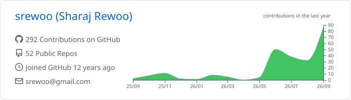
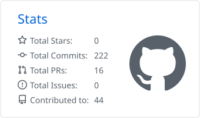
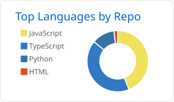

# Hi there, I'm Sharaj Rewoo 👋

### QA & Developer-Tools Engineer | Builder of local-first AI tooling

**29 free, local-first Chrome extensions for developers, QA engineers and prompt engineers. Manifest V3, bring-your-own-key AI, no backend tracking.**

---

## 👨‍💻 About Me

I build small, focused tools that take the drudgery out of testing and shipping software:

- **AI-assisted QA:** turn user stories, browser sessions and live traffic into runnable tests.
- **Local-first by default:** your data stays in your browser. AI runs on your own API key.
- **Code and API intelligence:** repo-aware review, API drift detection, query optimisation.

---

## 🌟 Featured Projects

### 🧪 QA & Test Generation
| Project | What it does |
|---|---|
| [QAtalyst](https://github.com/srewoo/QAtalyst) | AI test-case generator: stories/specs → positive, negative and edge-case suites |
| [FlowScribe](https://github.com/srewoo/FlowScribe) | Records browser journeys → ready-to-run Playwright/Puppeteer scripts |
| [Gotcha](https://github.com/srewoo/gotcha) | One-click bug reports (screenshot, console, network, DOM) → Jira/Linear + Playwright regression test |
| [Pathfinder](https://github.com/srewoo/Pathfinder) | Autonomous UI crawler that maps flows and flags untested branches |
| [LingoAI](https://github.com/srewoo/lingoAI) | l10n/i18n QA: translation, truncation and layout defects |

### 🔌 API & Network
| Project | What it does |
|---|---|
| [XHRScribe](https://github.com/srewoo/XHRScribe) | Live XHR/fetch traffic → runnable API tests with assertions |
| [APItiser](https://github.com/srewoo/APItiser) | API integration tests generated from source code |
| [Telltale](https://github.com/srewoo/telltale) | Learns API contracts from traffic and alerts on schema drift |
| [Mockingbird](https://github.com/srewoo/Mockingbird) | Intercept, edit and mock HTTP per tab with no proxy certs |

### 🛠️ Dev Tools & Code Intelligence
| Project | What it does |
|---|---|
| [RepoSpector](https://github.com/srewoo/RepoSpector) | Natural-language code queries and AI code review for any GitHub repo |
| [litmus](https://github.com/srewoo/litmus) | System-prompt tester with auto-generated LLM-as-judge rubrics |
| [speeDB](https://github.com/srewoo/speeDB) | Finds SQL in GitHub/GitLab repos and proposes output-identical optimisations |
| [needle-mcp](https://github.com/srewoo/needle-mcp) | MCP building blocks for incident RCA investigations |
| [PerfLens](https://github.com/srewoo/perflens) | Real-session Core Web Vitals observer (LCP, CLS, INP) |
| [StyleSpy](https://github.com/srewoo/StyleSpy) | Freeze hover/active states, extract clean selectors and XPath |

➡️ **All 29 extensions:** [sharaj.pages.dev](https://sharaj.pages.dev/)

---

## 🛠️ Tech Stack

- **Languages:** TypeScript, JavaScript, Python
- **Testing:** Playwright, Cypress, Puppeteer, Mocha, k6
- **AI:** LLM APIs (BYOK), LLM-as-judge evals, MCP servers, RAG
- **Platform:** Chrome Extensions (Manifest V3), Node.js, IndexedDB

---

## 📊 GitHub Stats

  

  
  

---

  Built with care by Sharaj Rewoo · <a href="https://sharaj.pages.dev/">sharaj.pages.dev</a>

